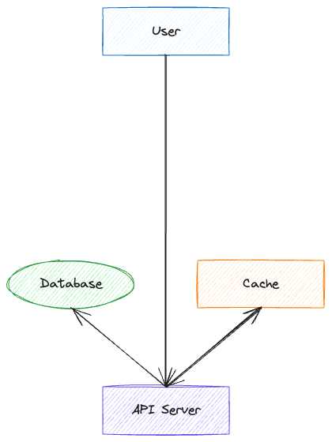
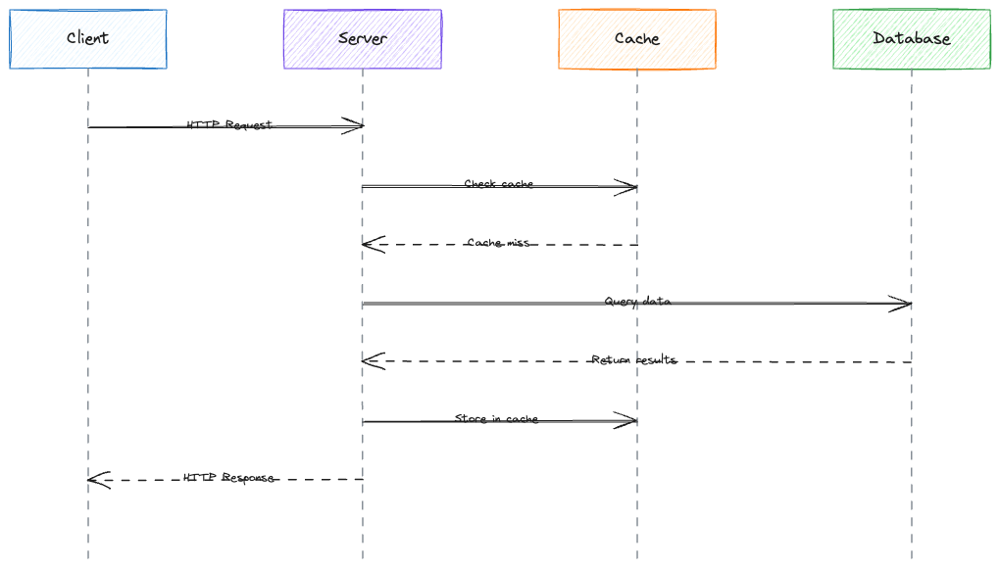
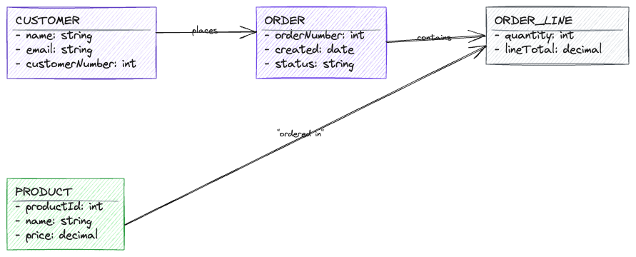

# mermaid-to-excalidraw-mcp

MCP server that converts Mermaid diagrams to styled Excalidraw files.

> Generated with [Claude Code](https://claude.ai/code)

## The Problem

When asking Claude to create diagrams, you have two bad options:

1. **Generate Excalidraw JSON directly** - Works, but costs ~500 tokens per shape. A simple 5-node diagram = 2500+ tokens of JSON in Claude's response.

2. **Use existing mermaid-to-excalidraw** - Token-efficient input, but strips all colors and requires a browser.

## The Solution

This MCP server lets Claude write compact Mermaid (30 tokens) and outputs styled `.excalidraw.md` files directly to disk - no tokens wasted on JSON output.

```
You: "Create an architecture diagram: React -> API -> PostgreSQL + Redis"

Claude writes: ~50 tokens of Mermaid
Output: Styled diagram saved to file
```



## Setup

```bash
git clone https://github.com/yannick-cw/mermaid-to-excalidraw-mcp
cd mermaid-to-excalidraw-mcp && npm install && npm run build
```

Add to `~/.claude.json`:

```json
{
  "mcpServers": {
    "mermaid-excali": {
      "command": "node",
      "args": ["/absolute/path/to/mermaid-to-excalidraw-mcp/dist/index.js"]
    }
  }
}
```

## Usage

Just ask Claude to create a diagram and specify where to save it:

> "Create an ER diagram for a blog system with users, posts, and comments. Save to ~/diagrams/blog.excalidraw.md"

The output file opens directly in **Obsidian** (with [Excalidraw plugin](https://github.com/zsviczian/obsidian-excalidraw-plugin)) or can be imported to **excalidraw.com**.

## Features

**Diagram types:** Flowcharts, sequence diagrams, ER diagrams

**Semantic colors** - Add a directive to color nodes by type:

```mermaid
%%{excali: styles: {FE: ui, API: api, DB: db, Cache: cache}}%%
flowchart TD
    FE[React App] --> API[Node Service]
    API --> DB[(PostgreSQL)]
    API --> Cache[Redis]
```

Available styles: `ui` `api` `db` `cache` `queue` `gateway` `external` `agent` `storage` `user` `orchestrator` `problem` `solution` `highlight`

**Connected arrows** - shapes stay linked when you move them

**Embedded source** - original Mermaid preserved in the file for portability

## More Examples





## Inspired by

- [mermaid-to-excalidraw](https://github.com/excalidraw/mermaid-to-excalidraw) - the original, browser-based
- [obsidian-excalidraw-plugin](https://github.com/zsviczian/obsidian-excalidraw-plugin) - what makes `.excalidraw.md` work
